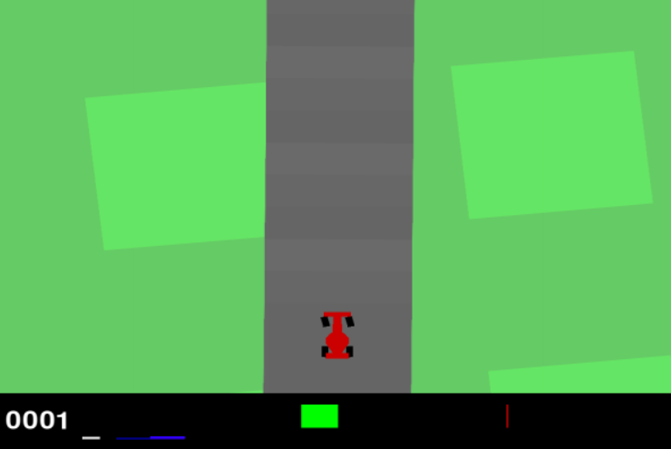
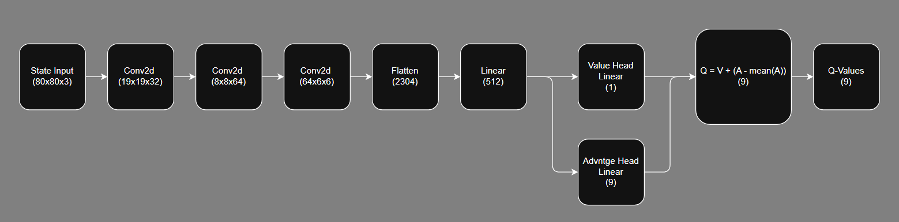
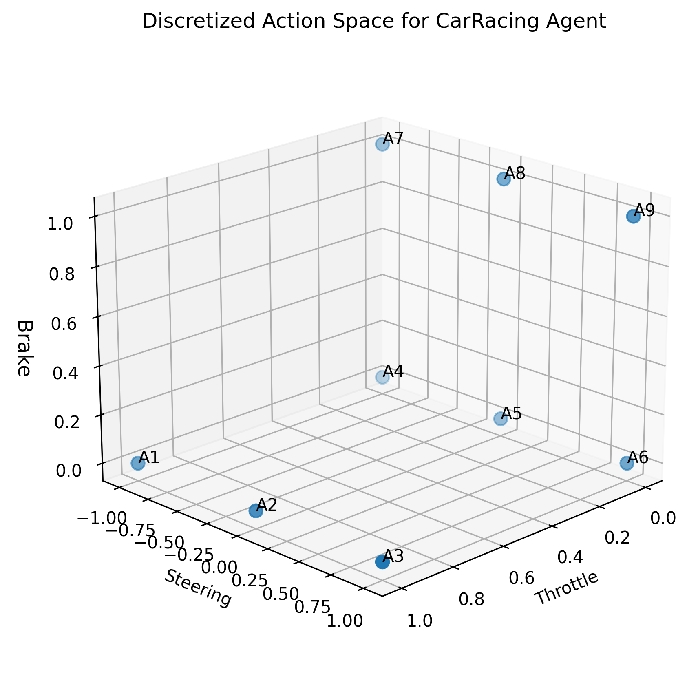
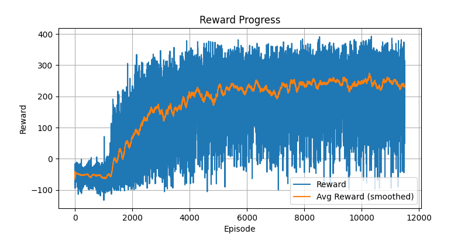
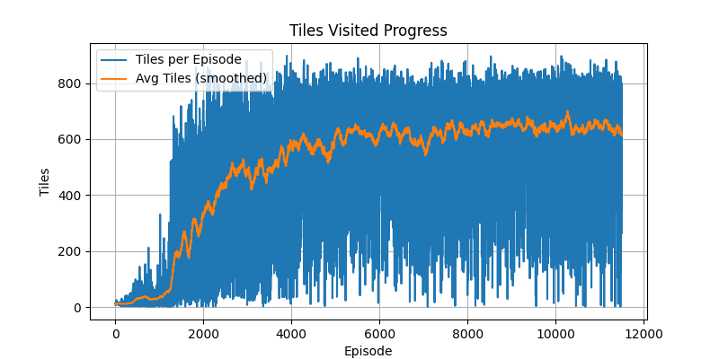
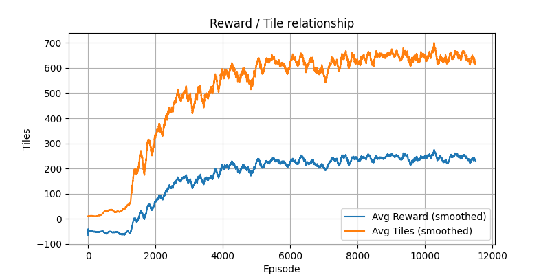

# Deep Reinforcement Learning for Autonomous Driving  
### Double-DQN with Rollout Planning in CarRacing-v3

## Project Overview

This project explores dynamic programming through deep reinforcement learning using the **CarRacing-v3 environment from OpenAI Gymnasium**. The environment presents a sparse reward structure and continuous control over steering, throttle, and braking.

To solve this task, I implemented a **Double Deep Q-Network (Double DQN)** with a **Dueling Network Architecture**, written from scratch. The final system integrates:

- state space conditioning  
- action space discretization  
- custom reward shaping  
- short-horizon rollout planning  

The resulting agent learns **stable and efficient driving behavior while maintaining competitive lap times**.



---

## State Space Conditioning

The CarRacing environment provides **96×96 RGB images** of the vehicle and track. To provide temporal information to the model:

- The **four most recent frames are stacked**
- Each frame is **converted to grayscale**
- Frames are **cropped to 80×80**

This transforms the input into a **time-based channel representation**, where the channel dimension represents recent motion rather than color.

**Input shape:** `(4, 80, 80)`

The frames are processed by a **Convolutional Neural Network (CNN)** that estimates the expected future reward for each possible action.

After feature extraction, the network splits into a **dueling architecture**:

- **Value Head** → estimates the value of the current state  
- **Advantage Head** → estimates the relative advantage of each action  

The final Q-values are computed using:

```
Q(s,a) = V(s) + (A(s,a) − mean(A(s,a)))
```

This decomposition improves learning stability by separating **state evaluation from action comparison**.



---

## Action Space Conditioning

CarRacing uses a **continuous action space** consisting of:

- steering  
- throttle  
- brake  

Since Q-learning requires a discrete action set, the control space was **discretized into nine representative actions**. These combinations provide sufficient flexibility for complex trajectories while keeping the learning problem tractable.



---

## Reward Shaping

The default reward signal in CarRacing is sparse and difficult to optimize. The environment only rewards:

- reaching new tiles on the track  
- a small per-frame penalty  

To improve learning stability, I implemented a **custom reward shaping system** that encourages smooth and controlled driving.

The reward function includes:

- **Forward Progress Reward**  
  Reward for advancing along the track while remaining on the road and respecting a speed limit near turns.

- **Turn Preparation Reward**  
  Encourages the agent to slow down when approaching a turn at high speed.

- **Angular Velocity Stabilization Reward**  
  Penalizes excessive angular velocity when moving quickly.

- **Centerness Reward**  
  Encourages staying near the center of the track when no turn is visible.

- **Target Speed Reward**  
  Encourages maintaining an optimal cruising speed on straight sections.

To compute these signals, several geometric features were extracted from the frame, including:

- whether the vehicle is **on or off the road**  
- the **distance to track borders**  
- the **centerness of the vehicle**  
- whether a **turn is visible ahead**

These were calculated using **luminosity maps and ray-casting from the vehicle to detect road boundaries**.

These modifications significantly improved training stability and policy quality.


---

## Rollout Planning

A key component of this project is a **short-horizon rollout planner**.

At each timestep:

1. **Nine candidate agents are spawned**, one for each discrete action.
2. Each agent executes its initial action.
3. The **learned Q-network policy simulates additional steps forward**.
4. The **cumulative rewards of the simulated trajectories are compared**.

The action associated with the highest rollout reward is selected.

Tie-breaking uses the base Q-network policy.

Through experimentation, the optimal parameters were found to be:

- **Rollout length:** 20 steps  
- **Speed limit:** 95 units  

This planner dramatically improves stability and produces **smoother racing lines and better corner entry speeds**.


---

## Training Observations and Generalization

Early training revealed a strong bias toward **left turns**, caused by the environment's tendency to generate **counter-clockwise tracks**.

To improve generalization, the training pipeline randomly **flips the vehicle orientation at the start of each episode**, effectively reversing the track direction.

This simple augmentation balanced turning distributions and improved performance across both directions.


---

## Results

During training, the following metrics were tracked:

- episode reward  
- number of tiles visited  

The model began improving after roughly **1,200 episodes** and continued learning through **12,000 total episodes**.

Tiles visited and reward were strongly correlated, confirming that **track progression remained the primary learning signal** while the passive rewards improved driving quality.





---

## Policy Comparison

The final comparison between the **base policy** and the **rollout-enhanced policy** reveals clear behavioral differences.

The base policy is capable of completing laps but tends to:

- brake late in turns  
- take inconsistent racing lines  
- lose speed during corner exits  

The rollout planner instead learns strategies commonly used in professional racing:

- **early braking before turns**  
- **maintaining optimal corner entry speed**  
- **tighter racing lines**

These behaviors emerge naturally from reinforcement learning and significantly improve driving stability and lap efficiency.

**base policy score**: 901
**rollout score**:     923

